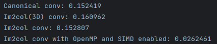
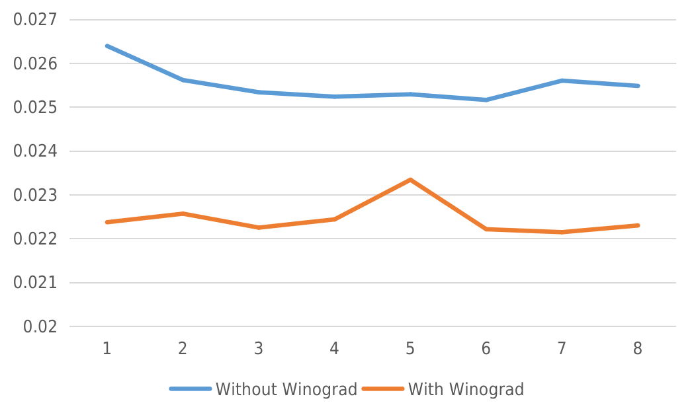
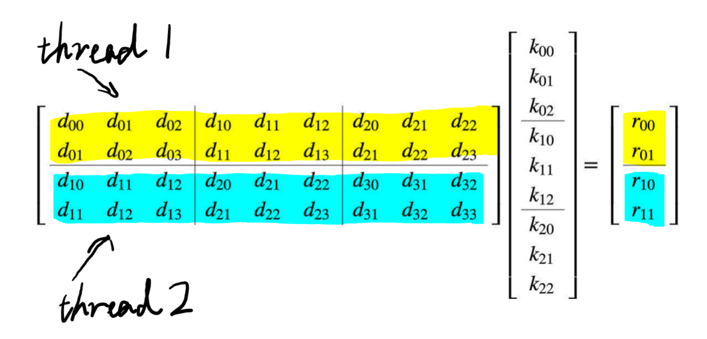

# Im2col

## Simple Usage
See `main.cpp`.

## Files and Directories
```
Im2col
├── acc_function
│   ├── AcceleratorFunction.h        // The base class of accelertor functions.
│   └── winograd
│       ├── WinogradFunction_1D.cpp  // Winograd 1D. (****** HERE!!!!!! ******)
│       ├── WinogradFunction_1D.h
│       └── WinogradFunction.h       // The base classWinograd accelertor functions.
├── CMakeLists.txt
├── feature_map
│   ├── DirectFeatureMap.cpp
│   ├── DirectFeatureMap.h
│   ├── FeatureMap.h
│   ├── Im2colFeatureMap.cpp         // Im2col feature map that allows  
│   │                                   convolution with a accelerator  
│   │                                   function. (****** HERE!!!!!! ******)
│   ├── Im2colFeatureMap.h
│   ├── Im2colFeatureMap_OMP.cpp
│   └── Im2colFeatureMap_OMP.h
├── kernel
│   ├── DirectKernel.cpp
│   ├── DirectKernel.h
│   ├── Im2colKernel.cpp
│   ├── Im2colKernel.h
│   └── Kernel.h
├── main.cpp
├── output_map
│   ├── OutputMap.cpp
│   └── OutputMap.h
└── util
    └── GetTime.h

```
## Analysis

### Steady Improvement is Witnessed when Using Winograd

In Lab2 settings, my implementation is around 13% faster on average when using Winograd(2, 3),  
which is not beyond expectation because, in fact, Winograd does not break much spatial locality.  
As the size of a row is small under our settings, although it loads 2 rows at the same time, we  
can infer that it still need not reload data from memory to cache. 
### Parallelism
Still we can use OpenMP to parallel convolution even if Winograd is used, yet this time we cannot  
simply add the pragma in the innermost for loop because the innermost for loop will not loop for  
many times when we use Winograd (e.g., loop for K * R * S / 3 times when using Winograd(2, 3)).  
Here we'd better let one thread responsible for every two rows, which guarantees little parallel  
overhead (and also better locality actually).
