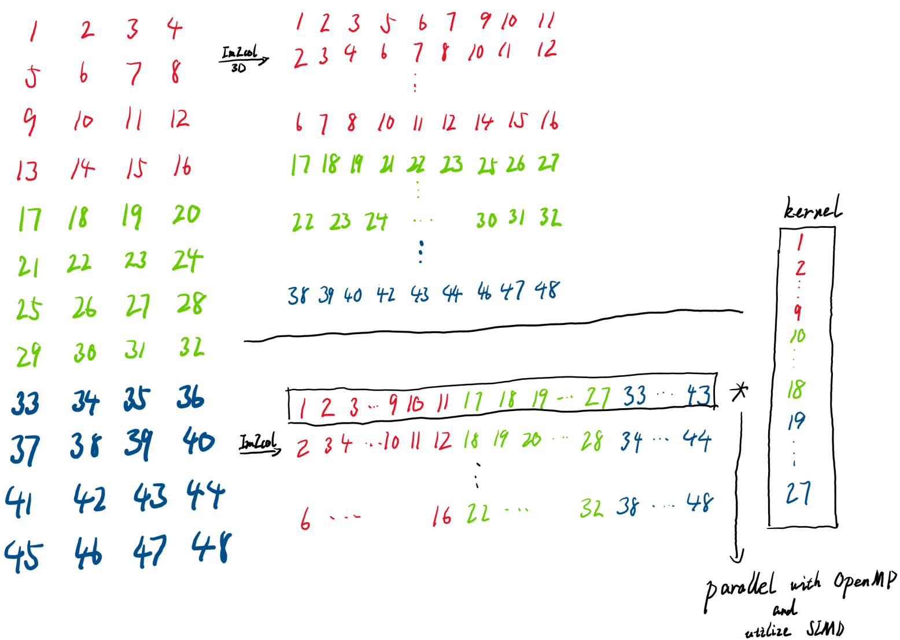

# Im2col

## Simple Usage
See `main.cpp`.

## Files and Directories
```
Im2col
├─CMakeLists.txt
├─README.md
├─main.cpp                               // Entry Point
├─output_map                             // Implementation of output map
|     ├─OutputMap.cpp
|     └OutputMap.h
├─kernel
|   ├─Canonical_Kernel.cpp               // Implementation of different kernels
|   ├─Canonical_Kernel.h
|   ├─Im2col_Kernel.cpp                  // Im2col kernel (****** HERE!!!!!! ******)
|   ├─Im2col_Kernel.h
|   ├─Im2col_Kernel_3D.cpp               // Also Im2col kernel, but channels are not flattened
|   ├─Im2col_Kernel_3D.h
|   ├─Kernel.cpp                         // Base kernel
|   └Kernel.h
├─feature_map                            // Implementation of different feature maps
|      ├─Canonical_FeatureMap.cpp        // Canonical feature map
|      ├─Canonical_FeatureMap.h
|      ├─FeatureMap.cpp                  // Base feature map
|      ├─FeatureMap.h
|      ├─Im2col_FeatureMap.cpp           // Im2col feature map (****** HERE!!!!!! ******)
|      ├─Im2col_FeatureMap.h
|      ├─Im2col_FeatureMap_3D.cpp        // Also Im2col feature map, but channels are not flattened
|      ├─Im2col_FeatureMap_3D.h
|      ├─Im2col_FeatureMap_OMP_SIMD.cpp  // Im2col feature map with OpenMP and SIMD enabled
|      └Im2col_FeatureMap_OMP_SIMD.h
```
## Analysis

### Comparison between canonical approach, Im2col
Im2col approach shows significantly better performance under the settings given in the material 
(C=3, H=4, W=4, R=3, S=3) as expected, but is not superior to canonical approach when kernel size 
grows relatively large (C=3, H=128, W=128, R=64, S=64).  
Personally, two fundamental factors lead to this phenomenon. First, Im2col reduces the number of random access 
of only one order of magnitude, yet random access itself is relatively not frequent when kernel gets large. 
Second, as mentioned in the course slides, Im2col produces fairly large memory overhead and may even lead to swaps 
when kernel is extremely huge.

### Im2col 3D
*You can just ignore this part if your time is limited because it is just something trivial.  
This feature map is more understandable as it does not flatten channels into a single dimension. It generally produces 
similar performance compared to Im2col. 

### Multiprocessing and SIMD
According to the diagram above, I regard the multiplication of a value in 
a scalar (a column in Im2col, but actually a row in my implementation) and a value in
a vector (flattened convolution kernel defined in Im2col) multiplication 
as the HPC kernel (not convolution kernel, why different areas in computer science always use the same terms 🥲).

Here I use OpenMP and SIMD only in the innermost for loop, as it is really easy to implement (by only adding one line 
of OpenMP declaration), does not produce too much workload, but has a remarkable result. From my point of view, Im2col 
is suitable for parallelism and SIMD for:  
1. No mutual access. Every cell in the output map is calculated separately.
2. Most calculations are done under the same instruction.

Convolution with OpenMP and SIMD enabled shows bad performance when the feature map and kernel are small, 
but gets dramatically faster when they get larger.
